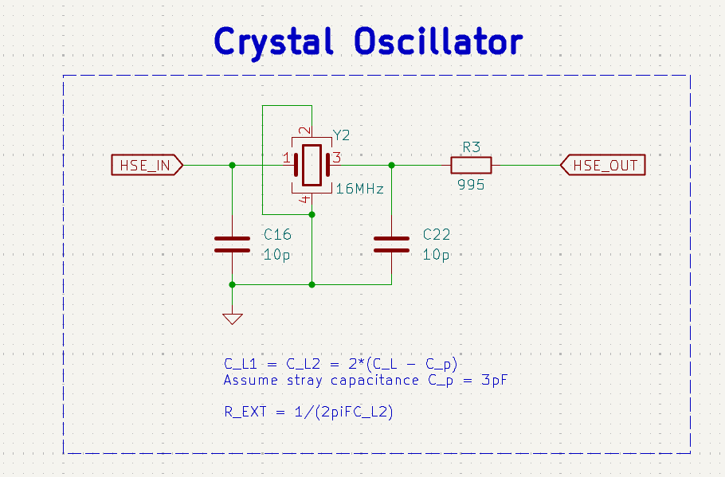

# HSE Crystal Oscillator

## 1. Purpose

This block implements the **High-Speed External (HSE)** oscillator for the MCU using a
16 MHz parallel-resonant crystal (Y2) connected between the MCU pins **HSE_IN** and
**HSE_OUT**.

The goal of the design is to:

- Provide a stable 16 MHz reference clock for the MCU PLL.
- Respect the crystal manufacturer’s required load capacitance and drive level.
- Minimize startup problems, frequency error, and EMI.

Schematic reference: `FC-proto.kicad_sch`  

---

## 2. Circuit Description

The oscillator is a standard **Pierce topology** using the MCU’s internal inverter:



- **Y2 – 16 MHz Crystal**

  - Connected between **HSE_IN** (left node) and **HSE_OUT** (right node).
  - Operated in fundamental mode, parallel resonance.
  - Typical crystal parameters (target when selecting the part):
    - Frequency: 16 MHz
    - Load capacitance, $(C_L)$: *8 pF* (example)
    - ESR: typically \< 60 Ω
    - Drive level: ≤ 100 µW

- **C16, C22 – Load Capacitors (10 pF)**

  - C16 from **HSE_IN** to GND.
  - C22 from **HSE_OUT** to GND.
  - Provide the correct effective load capacitance seen by the crystal together with
    stray capacitances.

- **R3 – Series Damping Resistor (9.95 Ω)**

  - Placed in series with the **HSE_OUT** pin.
  - Limits drive level into the crystal and can reduce overshoot / EMI.
  - Value chosen as a compromise between startup margin and damping.

The MCU internal feedback resistor and inverting amplifier, together with Y2,
C16/C22, and R3, form a closed-loop oscillator.

---

## 3. Load Capacitance Calculation

The crystal specifies a **load capacitance \(C_L\)** that it expects to “see”.
In a symmetric Pierce oscillator, the effective load is:

$$
C_L \approx \frac{C_1 \cdot C_2}{C_1 + C_2} + C_p
$$

Where:

- $(C_1)$ = C16
- $(C_2)$ = C22
- $(C_p)$ = total stray capacitance (MCU pins, package, pads, and short traces)

For a symmetric design $(C_1 = C_2 = C_L1)$:

$$
C_L \approx \frac{C_L1}{2} + C_p
$$

Rearranging:

$$
C_L1 = C_1 = C_2 = 2 \cdot (C_L - C_p)
$$

**Assumptions for this design:**

- Crystal load capacitance: $C_L = 8 \text{ pF}$
- Estimated stray capacitance: $C_p \approx 3 \text{ pF}$
  (typical for an MCU + short routing)

Then:

$$
C_1 = C_2 = 2 \cdot (8\text{ pF} - 3\text{ pF}) = 10 \text{ pF}
$$

So **C16 = C22 = 10 pF** are selected.

These equations are annotated on the schematic:

```text
C_L1 = C_L2 = 2 * (C_L - C_p)
Assume stray capacitance C_p = 3 pF
```

---

## 4. External Resistor Calculation

To calculate the external resistor we follow the formula:

$$
R_EXT = \frac{1}{2*pi*F*C_L2}
$$

With
$F$ the crystal frequency
$C_L2$ the second external load capacitance

---

## 5. References

The oscillator circuit design described here is based on ST microelectronics recomendations

[Guidelines for oscillator design](../../../resources/manufacturer-notes/an2867-guidelines-for-oscillator-design-on-stm8afals-and-stm32-mcusmpus-stmicroelectronics.pdf)

The crystal specs can be found in the datasheet:

[Crystal Datasheet](../../../resources/datasheets/CRYSTAL/TSX-3225_en.pdf)