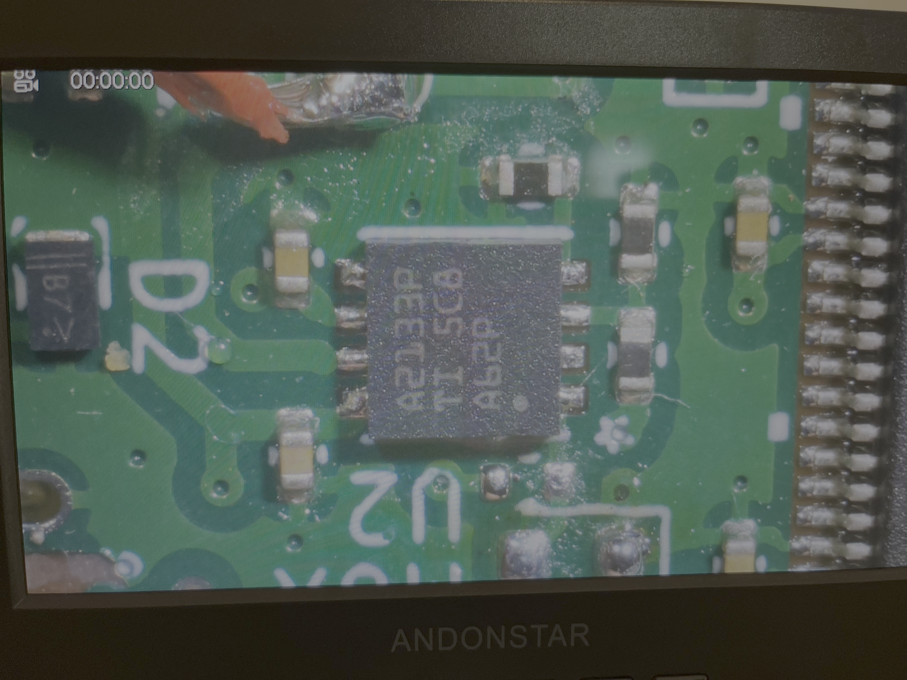
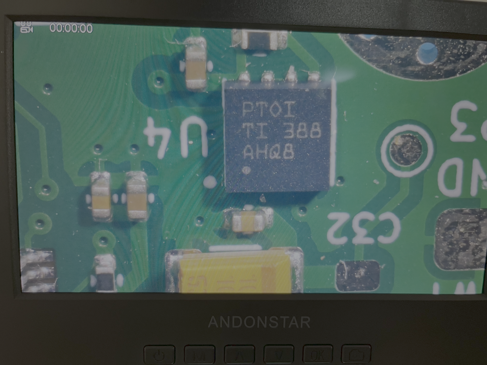

This file reports the tests done on the board and the different issues encountered. 
(Version tested: **0.9.5**)

Three boards of this version were produced and almost fully assembled by the manufacturer JLCPCB.

Parts not assembled:
- GH connectors
- USB-C socket
- SD card socket (back of the board)
- STM32 BOOT Slide switch (back of the board)
- O Ohms jumper resistors (connects the power stage to the rest of the board)

In this document we reffer to each board produced as board A, B and C.
## Power section

### Hardware operations

**Operations done on board A:**
- Soldering of every components (hot air blower + soldering paste)
- Board edges removed
- USB-C not properly soldered -> failed when plugging -> damages on USB power traces
- Power wires soldering
- Voltage test -> ❌  Voltage MUX not working
- Desoldering of jumper resistors
- Voltage test -> ❌  Voltage MUX still not working

**Operations done on board B:**
- Power wires soldering
- Voltage test ->  ✅ Every voltages nominal
- Soldering of jumper resistors (soldering iron)
- Board edges removed
- Voltage test ->  ✅ Every voltages nominal, 🚨 Power led working

**Operations done on board C:**
- Board edges removed
- Power wires soldering
- Voltage test -> ❌  Voltage MUX not working
- USB-C soldered -> power through USB -> ❌  Voltage MUX still not working

### MUX checks

#### First checks

Visual inspection (Microscope):
- No apparent damages on the IC and nearby passives
- Looks properly soldered

![[Capture d’écran 2026-05-28 à 21.54.42.png]]

Measures on board C MUX when powered (through USB):
Pin voltages:
- STAT = 0V
- EN_ = 0V
- VSNS = 0V
- ILIM = 0V
- IN1 = 0V
- OUT = 0V
- IN2 = 5.2V
- GND = 0V

Measures on board C MUX unpowered:
- Output <-> GND = 2 MOhms
- Output <-> IN1 = 2.5 MOhms
- Output <-> IN2 = 2.4 MOhms
=> No unexpected shorts noticed

Output voltage monitoring (osciloscope trigger) when IN2 is powered up:
=> When the rising edge of IN2 is detected -> No voltage change detected on OUT

*Note: 
- The MUX on Board A seems to have the same behavior
- These electrical tests have been conducted without load (power stage only)*

#### New checks

We supply 5V through the 5VSYS power rail to bypass the MUX for boards A abd C.

=> The buck coonverter works properly but the LDO is shorted and smokes.

It appears the LDO and MUX have been interchanged on boards A and C, thus causing all these issues.
We noticed it thanks to the ICs top marking: `A2133P` for the LDO and `PTOI` for the MUX.

### Conclusion

We now know the power issues we had on board A and C are not due to a design fault but to an assembly mistake by our PCBA manufacturer. The LDO and MUX ICs (U4 and U2)
have indeed been interchanged.

## Sensor section
## References

[Voltage MUX Datasheet](resources/datasheets/POWER/TPS2113a.pdf)